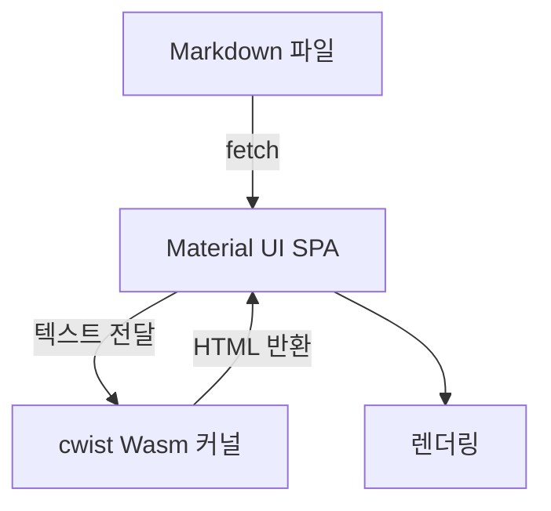

# Emscripten과 Material UI의 조합

GitHub Pages에서는 서버 사이드 렌더러를 올릴 수 없기 때문에, 정적인 빌드와 브라우저 내부 연산을 조합해야 합니다. 이번 블로그는 다음과 같은 순서로 로드됩니다.

1. (당시 구조 기준) Material UI 앱은 `posts/catalog.json`을 먼저 읽어 카테고리와 메타데이터를 가져왔지만, 현재 버전에서는 `categories.cfg`와 프런트 매터가 같은 역할을 합니다.
2. 사용자가 카드를 클릭하면 실제 `.md` 파일을 fetch 합니다.
3. Emscripten으로 빌드된 cwist 런타임이 문자열을 받아 md4c로 HTML을 생성합니다.
4. 결과를 React 상태로 주입하여 안전하게 표기합니다.

> **Tip**: 새 글을 작성할 때는 `categories.cfg`에 카테고리 정보를 추가하고, `posts/<카테고리>/`에 프런트 매터가 포함된 `.md` 파일을 저장한 뒤 `make static-site`만 실행하면 됩니다.

Material UI 테마는 `createTheme`로 생성하며 `palette.primary.main`을 주황색으로 맞춰 baboship의 하이라이트 감성을 이어갑니다. `ThemeProvider`와 `CssBaseline`을 통해 다크/라이트 모드의 대비를 유지하면서도 가독성을 살렸습니다.
